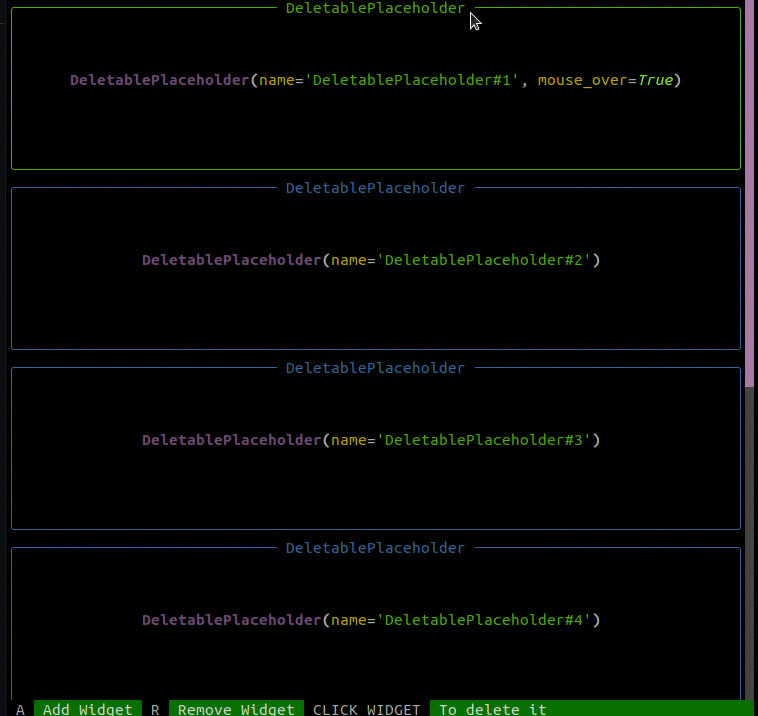

# Unofficial [Textual](https://github.com/Textualize) List View (Scrollable list of widgets)
While waiting for [ticket](https://github.com/Textualize/textual/projects/1#card-66941810) (also mentioned [here](https://github.com/Textualize/textual/discussions/196)) and official `ListView`, you can use this dirty version that allows you to scroll thrue list of widgets.  

## Demo


## Installation
This is not pip package but you can install this with pip:
```bash
pip3 install git+https://github.com/Cvaniak/TextualListViewUnofficial.git 
```

## Usage
Then in code you can use it this way:
```python
from ck_widgets_lv import ListViewUo

class TestListView(App):
    async def on_mount(self, event: events.Mount) -> None:
        await self.view.dock(ListViewUo(widgets=[Placeholder(height=10) for _ in range(20)]))

if __name__ == "__main__":
    TestListView.run()
```

or more complex example (from gif demo above):
```python3 
from textual.widgets import Placeholder
from textual.widget import Widget
from textual.events import Message
from textual.app import App
from textual import events

from ck_widgets_lv import ListViewUo

if __name__ == "__main__":
    from textual.widgets import Footer

    class DeleteStatus(Message):
        def __init__(self, sender: Widget):
            super().__init__(sender)


    class DeletablePlaceholder(Placeholder):
        async def on_click(self, event: events.Click) -> None:
            await self.emit(DeleteStatus(self))


    class TestListView(App):
        async def action_add(self) -> None:
            await self.list_view.add_widget(DeletablePlaceholder(height=10))
            self.refresh()

        async def action_remove(self) -> None:
            await self.list_view.remove_widget_by_index()
            self.refresh()

        async def on_load(self, _: events.Load) -> None:
            await self.bind("a", "add()", "Add Widget")
            await self.bind("r", "remove()", "Remove Widget")
            await self.bind("Click Widget", "_()", "To delete it")

        async def on_mount(self, event: events.Mount) -> None:
            self.list_view = ListViewUo(widgets=[DeletablePlaceholder(height=10) for _ in range(7)])
            await self.view.dock(Footer(), edge="bottom")
            await self.view.dock(self.list_view)

        async def handle_delete_status(self, message: DeleteStatus):
            await self.list_view.remove_widget(message.sender)

    TestListView.run()
```
